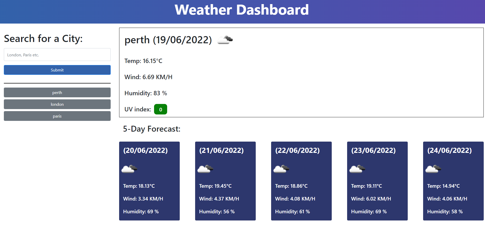

# Module 6 - Weather Dashboard
## Description
Create a weather app that allows for a user input to provide the forecast for the specified location over a period of 5 days.

## Table of Contents
1. [Visuals](#visuals) 
2. [Usage](#usage)
3. [Link to site](#link-to-site)

## Visuals

## Usage
This weather application is meant to take in data from a weather API and display it in a easy to read and simplistic manner. This is used to test our skills with API's, fetch calls, catch etc. The information on the application should be reliable as the API is being called from open weather map.

link to open weather map:
https://openweathermap.org/api/one-call-api

## Link to site
https://flipper5001.github.io/weather-dashboard/

